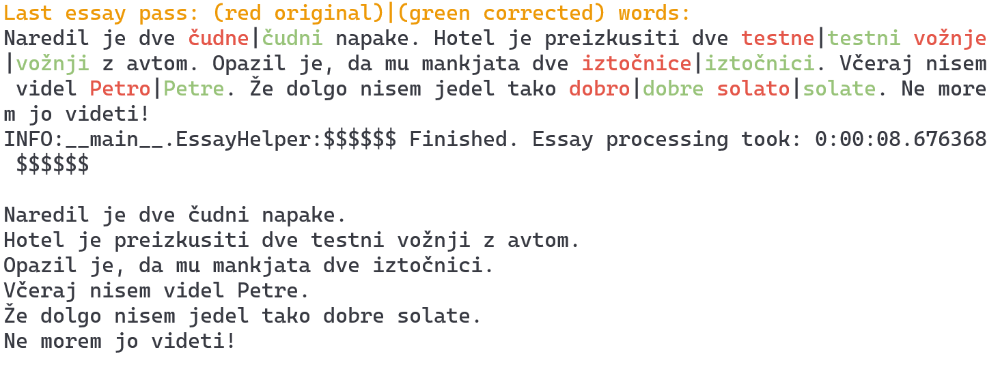

# EssayHelper

V tem repozitoriju je objavljen program, ki smo ga razvili v sklopu diplomske naloge na *Fakulteti za računalništvo in informatiko*.
Naslov diplomskega dela je:

[***Predlogi jezikovnih popravkov v slovenščini z modelom SloBERTa***](https://repozitorij.uni-lj.si/IzpisGradiva.php?id=139688&lang=slv) oz. angl.

[***Proposing Slovene grammar corrections using SloBERTa model***](https://repozitorij.uni-lj.si/IzpisGradiva.php?id=139688&lang=eng).

Spodaj so objavljena kratka navodila za postavitev okolja in zagon programa.

## Primer izpisa obdelave besedila:

## Quickstart and installation instructions
1. requirements:
    - conda
    - cuda drivers (optionally)
2. Get the repo:

    `git clone https://github.com/timopetric/EssayHelper.git`

    `cd EssayHelper`

3. Create conda environment:

    `conda env create -f environment.yml`
    
    `conda activate EssayHelper`

4. Download required files (only once):

    `python src/download_files.py`

5. Run program `hello_world.py` or `SloHelper.py` for eval:

    `python src/hello_world.py`

#### Export or update conda env with:

`conda env export --no-builds > environment.yml`

`conda env update -f environment.yml`

### Korpus Lektor
V direktoriju `corpus/Lektor/` so tri datoteke, ki smo jih uporabili za učeneje mejnih vrednosti in evalvacijo rešitve.
Datoteke v vrsticah vsebujejo lektorirane in prečiščene povedi iz korpusa [Lektor](https://slovenscina.u3p.si/korpusi/lektor/).

  
*Contact me or open a new issue if you have any questions or have truble setting up the environment.*
